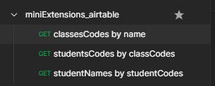
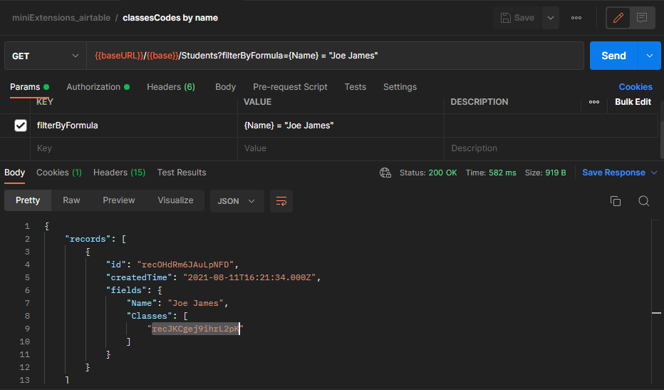
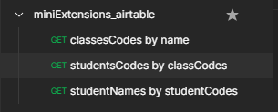
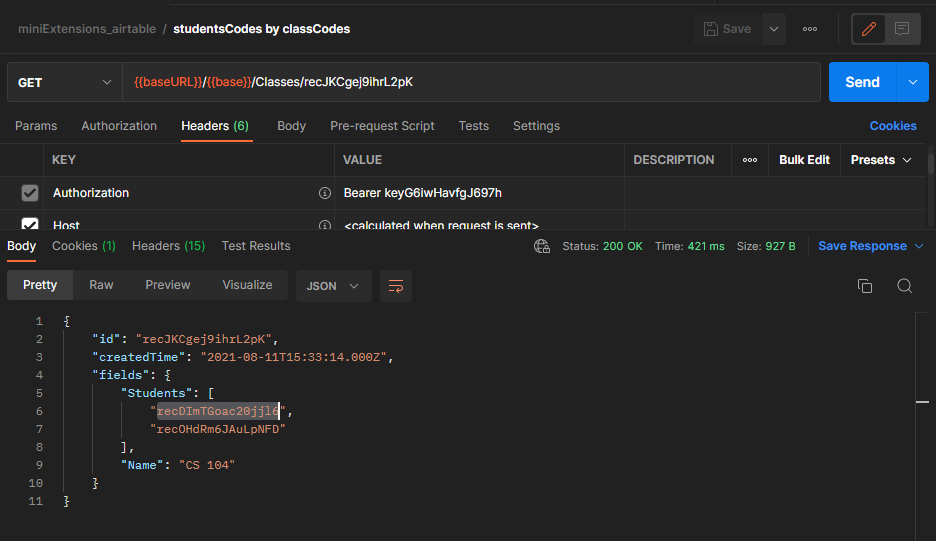
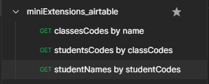
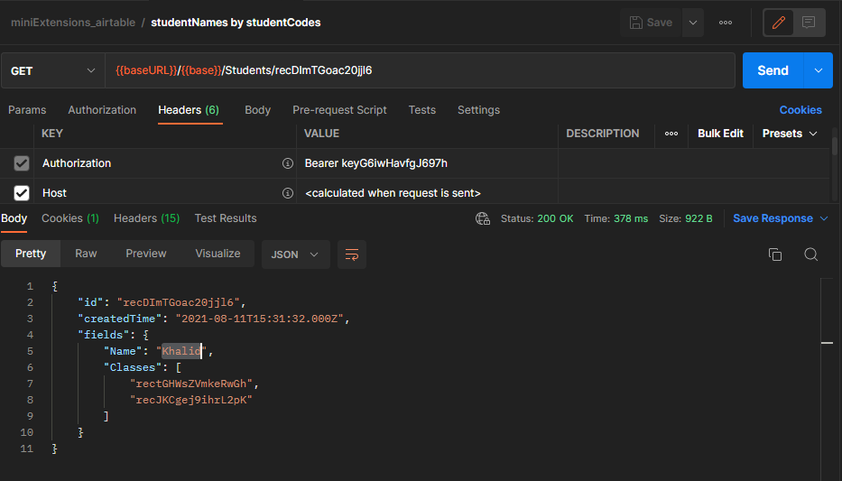

# minExtensions

## 0. Folder Structure

```txt
|- minExtensions/
|   |- src/
|   |   |- __TESTS__/
|   |   |- __MOCKS__/
|   |   |-  |- handlers.ts
|   |   |-  |- server.ts
|   |   |- Login.test.tsx
|   |   |- Profile.test.tsx
|   |   |- Api/
|   |   |   |- index.ts
|   |   |   |- airtable.tsx
|   |   |   |- helpers/
|   |   |   |   |- fetchData.ts
|   |   |   |   |- getClassData.ts
|   |   |   |   |- getClassesData.ts
|   |   |   |   |- getStudentData.ts
|   |   |   |   |- getStudentName.ts
|   |   |   |   |- getStudentsNames.ts
|   |   |- components/
|   |   |   |- Card.tsx
|   |   |   |- Loader.tsx
|   |   |- Pages/
|   |   |   |- Login.tsx
|   |   |   |- Profile.tsx
|   |   |- Redux/
|   |   |   |- App/
|   |   |   |-  |- store.tsx
|   |   |   |- features/
|   |   |   |-  |- user.tsx
|   |   |- Styles/
|   |   |   |- index.styles.tsx
|   |   |- Types/
|   |   |   |- index.ts
|   |   |- setupTests.ts
|   |   |- TemplateWrapper
|  .env
```

- `Styles`: folder containing all the style files (files containing `className` values stored in different variables) used across the app.
- `components`: folder containing all the rusable components:

  - `Card.tsx`: component used to display a card with a title (representing the Class title) and a list (containing all student collegues in the class).
  - `Loader.tsx`: component used to display a loader while the app is loading.

- `Pages`: folder containing all the pages:

  - `Login.tsx`: page containg a form for log in with an `input` and a `button` (also includes `handleSubmit` function for form handling submissions).
  - `Profile.tsx`: page containg a logout `button` alongside a heading (`h1`) (for student name) and an unordered list (`ul`) of `Card` componnents (for all the classes the student is in).

- `Redux`: folder containing all the files and folders that has to do with state. It has 2 folders inside:

  - `App`: that contains the `store.tsx` file which includes all configs for the store.
  - `features`: that contains the `user.tsx` file which includes all the reducers and `intialState`. (the file names are recommended by Redux)

- `Api`: folder containing files and folders for requesing data from `airtable` API. It has 1 file and 1 folder inside:

  - `airtable.tsx`: file containing the configs for setting the base for the API (e.g: `AIRTABLE_API_KEY`).
  - `helpers`: folder containing all the helper functions for the API.
  - `index.ts`: file containing the imports and exports for the helpers functions

    > **Note:** for more information about the functions and how they work together, please refer to the "**4. Api**" section below.

- `Types`: folder containing all the files and folders that has to do with types. It has 1 file:

  - `index.ts`: file containing all types used in the app.

- `__TESTS__`: folder containing all the files and folders that has to do with tests. It has 1 file:

  - `Login.test.tsx`: file containing all the unit tests for the `Login` page.
  - `Profile.test.tsx`: file containing all the unit tests for the `Profile` page.
  - `__MOCKS__`: folder containing all the files and folders that has to do with the API mocks. It has 2 file:

    - `server.ts`: file containing the setup for the `msw` server.
    - `handlers.ts`: file containing the setup for the `msw` handlers.

- `TemplateWrapper`: the Wrapper for the `App` component with (Browser Router and Providers).

- `.env`: file containing the api key and base id for airtable.

## 1. Components & Pages

### Login Page

- ```txt
  |- form
  |   |- label
  |   |   |- input
  |   |- button
  ```

### Profile Page

- ```txt
    |- <>
    |   |- h1
    |   |- form
    |   |   |- button
    |   |- ul
    |   |   |- li
    |   |   |   |- Card
  ```

### Card Component

- ```txt
    |- article
    |   |- h2
    |   |- h3
    |   |- h2
    |   |- ul
    |   |   |- li
  ```

### Loader Component

- ```txt
    |- div
    |   |- div
  ```

## 2. Styles

1. **tailwind** was used for styling

   ```html
   <!-- public/index.html -->

   <!-- using the tailwind CDN in the index.html file -->
   <script src="https://cdn.tailwindcss.com"></script>
   ```

2. a seprate `Styles` folder was created and all the style files were moved there. inside the folder, a single file `index.styles.tsx` was created.

   ```tsx
   // src/Styles/index.styles.tsx

   // every constant contains the tailwind styling utility classes for each component in the app
   const uiStyles = `
     flex
     flex-wrap
     justify-between
     gap-10
   `;
   ```

3. these constants are then imported inside the component as needed. Then used as values for `className`s.

   ```tsx
   // src/Pages/Profile.tsx

   import { uiStyles } from "../Styles/index.styles";

   const profile = () => {
     return <ul className={uiStyles}>{/* ...code */}</ul>;
   };
   ```

## 3. State (Redux)

> **Note:** used [`Redux toolkit`](https://redux-toolkit.js.org/api/createslice#name) for a more concise and readable code.

In Redux toolkit, the `store` consists of a collection of `slices`. Each `slice` is an object with an **initial state**, an object of **reducer functions**, and a `"slice name"` and automatically generates action creators and action types that correspond to the reducers and state.

- The state is managed using a central store (`src/Redux/App/store.tsx`).

  ```tsx
  // src/Redux/App/store.tsx

  export const store = configureStore({
    reducer: {
      user: userReducer, // reducer for the user state
    },
  });
  ```

- A `user` slice is created with the `login` and `logout` reducers.

  ```tsx
  // src/Redux/features/user.tsx

  const userSlice = createSlice({
    name: "user",
    initialState,
    reducers: {
      login: (
        state: initialUserStateType,
        action: PayloadAction<initialUserStateType["value"]>
      ) => {
        state.value = action.payload;
      },
      logout: (state: initialUserStateType) => {
        state.value = initialState.value;
      },
    },
  });
  ```

- in the `Login.tsx` page, the `useDispatch()` hook is used to dispatch the `login` action.

  ```tsx
  // src/Pages/Login.tsx

  import { useDispatch } from "react-redux";
  import { login } from "../Redux/features/user";

  const login: FC = () => {
    const dispatch = useDispatch();
    const handleSubmit = (e: React.FormEvent<HTMLFormElement>) => {
      // ...code
      useDispatch(login(/* ...data */));
      // ...code
    };
    // ...code
  };
  ```

- in the `Profile.tsx` page, the `useSelector` hook is used to get the user state from the store.

  ```tsx
  // src/Pages/Profile.tsx

  import { useSelector } from "react-redux";
  import { RootState } from '../Redux/App/store';


  const profile: FC = () => {
    const user = useSelector((state: RootState) => state.user.value);
    // ...code

    return (
      {/* ...code */}
      <h1>{user.studentName}</h1>
      {/* ...code */}
    );
  };
  ```

## 4. Api

### The plan is as follows

1. get student **name** and the **classes codes** for the classes the student is in (using `getStudentData()` function) based on `studentName` given by user in the `Login` form.
2. loop through the **classes codes** (using the `getClassesData()` function) and apply the `getClassData()` function for each class to get the **class Name** and the **codes of the students in that class**. And at the end return a List of the classes and their respective students' codes.
3. get the **students' names** using their codes (using the `getStudentsNames()` function).
4. return the **student name**, the **Names of the classes the student is in**, and the **Names of the other students in his classes**.

### A simplified version of the code

> **Note:** in the following example, async syntax was removed for a more clear and readable code.

```tsx
const [formInputField, setFormInputField] = useState("");

// ...code

// studentName: ""
// classesCodes: []
const [studentName, classesCodes] = getStudentData(formInputField);

// classesData: [{ className: "", studentsCodes: [] }]
const classesData = getClassesData(classesCodes);

// classesDataWithStudents: [{ className: "", studentsNames: [] }]
const classesDataWithStudentsNames = classesData.map({ className, studentsCodes }) => {
  const studentsNames = getStudentsNames(studentsCodes);
  return { className, studentsNames };
}

console.log(studentName, classesDataWithStudentsNames);
// => "student name", [{ "className", ["student name 1", "student name 2"] }]
```

> **Note:** Each function is contained in a single file as part of the the `helpers` folder inside of the `Api` folder. For each function there is a dedicated documentation that helps in understanding the purpose of that function.
>
> ```tsx
> // src/Api/helpers/getStudentData.tsx
>
> /**
>  * @param {string} studentName: the name of the student given by user in the input field of the login form.
>  * @returns {Promise<[string, string[]]>}: a promise with an array containing the name of the student (as returned by the API) and an array of the codes of the classes that the student is registered in.
>  * @description Returns the name of the student alongside the codes of the classes he joined.
>  * @example
>  * const [studentName, classesCodes] = await getStudentData('Joe');
>  * console.log(studentName, classesCodes);
>  * // => 'Joe', ['rec', 'rec']
>  */
> ```

### Mocking the API using PostMan

the following link (`https://www.getpostman.com/collections/5428013c8cc70aff9933`) contains the API mockup.

Request | Result
--------|--------
 | 
 | 
 | 

## 5. Testing

### Scienarios

#### Login Page expected behavior

1. when the `Login` page loads, the `Login` button should be disabled.
2. when entering **"invalid"** student name clicking on the `Login` button, it should show an error message.
3. when entering **"valid"** student name clicking on the `Login` button, it should list all classes of the student and all students in those classes.

#### Profile Page expected behavior

1. when clicking on the `Logout` button, it should redirect to the `Login` page.

### descritption

For testing the `react-testing-library` along-side `jest` were used. For Api mocks `msw` was used.

- All the tests are located in the `__TESTS__` folder.
- The `Login` page is tested in the `Login.test.tsx` file.
- The `Profile` page is tested in the `Profile.test.tsx` file.
- For Api mocks, the `__MOCKS__` folder is used.

> **Note:** It was planned to use `cypress` for end-to-end testing but the time constraint prevented it.

## Git

`git` was used for showing how the workflow was done.
